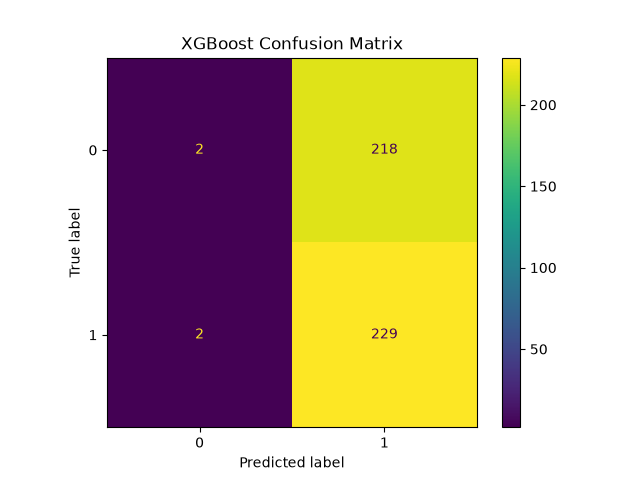
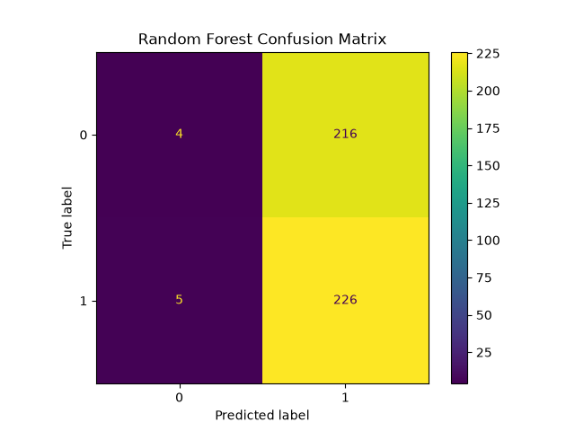
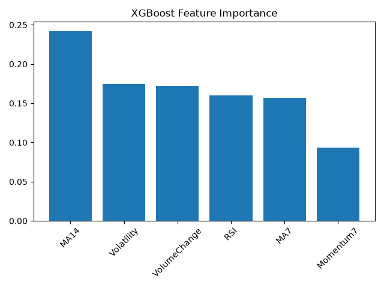
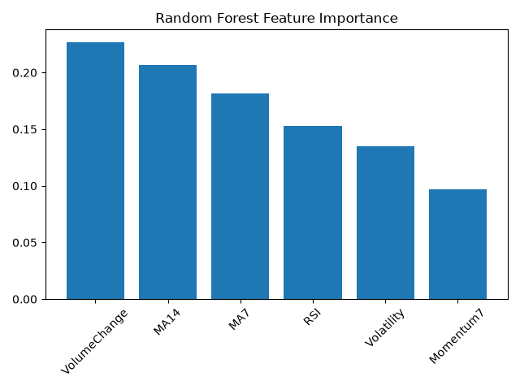

# Stock Direction Predictor
Binary classification model to predict stock price direction from historical data using sklearn and Weights &amp; Biases

## What this project predicts
Whether a stock's closing price will be higher or lower at the close of the next market day as a binary classification (Up or down from previous day)

## Why this project is interesting
I am interested in financial decisions and how data can be used to identify market trends. Stock prices are hard to predict as they can be influenced by unpredictable real world factors making machine learning more difficult.

## How success is measured
Model accuracy, precision and recall, AUC-ROC. Model will be compared against a baseline of always predicting a stock to rise since a stock price is more likely to rise than fall.

## Dataset
Yahoo Finance historical price data sourced via the yfinance Python library.
Amazon (AMZN) historical price data from 2015 to present.

## Design decisions
I am going to begin by building a model based around the prediction of amazon's stock price, my reasoning is that since it is a large diverse company that has been Mag 7 for a long time, it should have a more stable and more predictable stock price compared to a company like Nvidia which may be unstable and influenced a lot by real world trends.
I will use stock price data from 2015 to now, capturing the last 10 years as it includes a variety of market conditions such as a normal market, COVID crash and recovery, AI boom and crashes due to tariff announcements and trade tensions.
I am going to create moving averages of stock prices to filter out the noise and capture an overall trend. I will use both 7 and 14 day moving averages as that will capture an entire week rather than splitting weeks up which may result in some moving averages including a larger amount of closed market days such as the weekend. This ensures each moving average contains the same amount of open days. I will also capture a 7 day momentum change for the same reasons. Calculating volatility, volume change and RSI will also give the model more data to work with to improve accuracy.
Finally, a boolean target variable will be 0 or 1 if the next day's price is higher or not.

## Methodology 
When data is being prepared during modelling, train and test data cannot be split 80/20 randomly, it must instead be split with training data containing 80% of the oldest data and test data being the newest 20%.
This is to prevent the models being trained on future data and tested on past data as this would never happen in reality as you'd never have future data available when predicting and can result in the model appearing better than it really is.
The results I achieved between the two models were very similar, with both XGBoost and RandomForest achieving 51% accuracy. Due to the results being close to random it would suggest that historical data has little impact on stock price change and the models could not make accurate predictions.
After adding a lengthened list of parameter options for both models, XGBoost preferred a max depth of 4 and RandomForest a depth of 3. These shallow trees generalise better which indicates that the signals in the data are weak for predicting price change.

## Evaluation
The confusion matrices produced by both the XGBoost and RandomForest models had a similar outcome. Both clearly showed that the model generally predicted a stock price rise almost every single time. XGBoost only correctly predicted 2 down days and RandomForest slightly more at 4 correct down days with both showing roughly 50/50 odds again when predicting down days too.

  

This further evidences the conclusion that price history is a poor indicator of future stock price as the models performed best when almost always predicting rises. Both models had AUC-ROC scores of roughly 0.5 showing neither model is better at predicting price rises and falls than random chance. The baseline score of always predicting a price rise was 51.2% which is a very similar score to the models as the models essentially decided to do the same thing. Precision and recall scores reflected the confusion matrix results with both showing high recall for predicting price rises but near zero recall for price falls confirming that the models defaulted to just predicting rises.
When ranking each feature on importance, momentum appeared to be the weakest. This could be due to the fact a $10 momentum reading would be very different in 2015 vs 2023 due to the company valuation being higher in 2023 by proportion and also by inflation. A better measure of momentum would have likely been a percentage change instead of a monetary value. MA14 and Volume change were found to be two of the most important features across both models, although if they were truly exploitable, model accuracy would have been significantly higher than baseline which only suggests they were the most useful features in a weak set.

   

Another feature change I would make would be to change the moving average values of both MA7 and MA14 to instead be a ratio of one to another. The issue here is that Amazon's stock price has increased significantly and more dated entries will naturally have a lower moving average score compared to more recent entries which the model may treat as very different values despite perhaps representing an identical trend 10 years apart. 
The Efficient Market Hypothesis may be to blame for the weak performance of the models as it states that stock prices already reflect all publicly available information. This means that any exploitable indicator, if it were to exist, would have already been taken advantage of by several traders effectively eliminating the signal entirely. The results I have found here support this hypothesis directly. Any attempt for ML to beat the market would likely require non public information, more sophisticated features or access to news and information about global events in real time.

## Potential Improvements

## Conclusion
